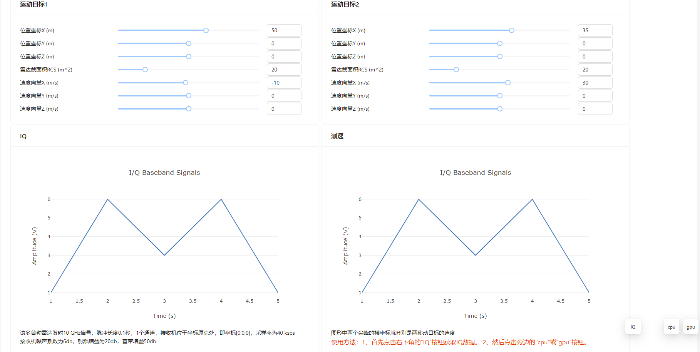
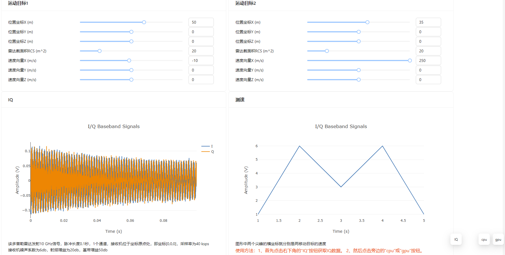
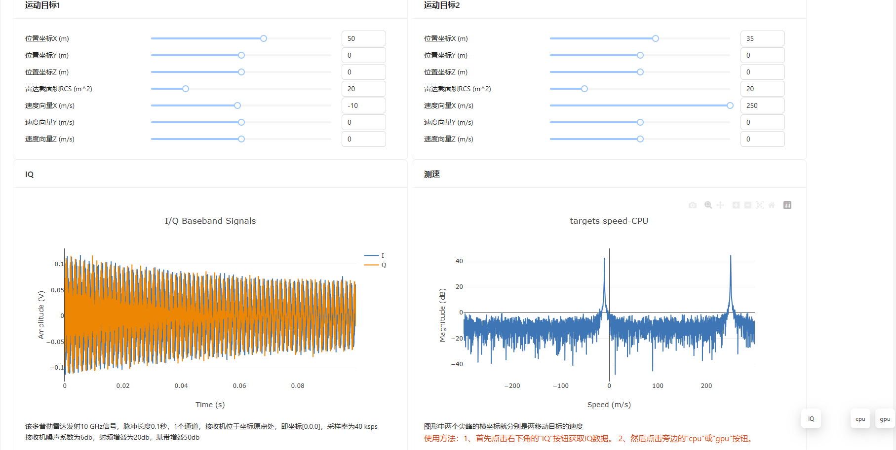

# 运行环境要求
windows10以上操作系统，RTX30系以上显卡（计算能力要求8.6或者8.9），cuda版本要求12.3。
# 项目启动
请从右侧[releases](https://github.com/betterLeoLee/Leo_s_toy_projects/releases/tag/doppler_radar "releases")下载`doppler_radar.7z`，解压后直接双击 `start.bat` 启动。项目会占用8082和8086端口用于通信。
# 项目简介
首先这是一个玩具项目，目的是想以最短开发时间体验一把雷达数据处理，以前工作中只处理过电磁信号，虽然都是处理IQ信号，但是数据处理方式和侧重点完全不同。因为只给了自己两天的开发时间，所以选择了多普勒雷达下手。其实通常情况下雷达数据的处理遇到的都是雷达数据立方体，这个项目为了减小数据量，快速跑通整个数据处理流程，只选择了多普勒雷达的单次脉冲数据（快时间数据）。

整个项目包含一个UI和两个后台服务。考虑到相同的时间消耗浏览器比qt更容易写出美观的界面，所以果断地选择了使用浏览器作为UI界面。  

cuda部分的`my_fftShift1D`和`fftshift`的作用都是将零频分量移动到数组中心。`my_fftShift1D`是在主机（cpu）上完成，`fftshift`是在显卡设备上完成。由于该操作主要是读写操作，几乎没什么计算，所以这个kernel是没什么加速效果的。有兴趣的可以注释掉`fftshift`，改用`my_fftShift1D`看看耗时差距有多少。

# 使用截图
## 初始状态
双击 `start.bat` 启动  
  
## 获得IQ信号
点击`IQ`按钮获取IQ信号  
  
## CPU计算结果
点击`cpu`按钮获取cpu计算结果  
  
## GPU计算结果
点击`gpu`按钮获取gpu计算结果  
  
